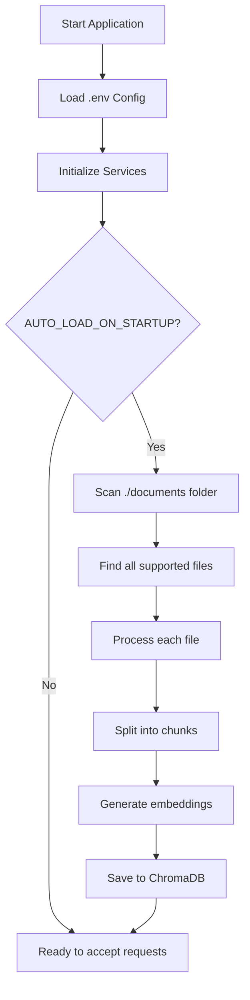
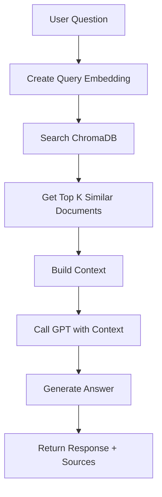

# Architecture & Workflow of RAG Chatbot API

## 📋 Overview

RAG (Retrieval-Augmented Generation) Chatbot API is an AI system that combines document information retrieval with GPT's text generation capabilities to answer questions accurately and with context.

### Working Principle

```
Documents → Embeddings → Vector DB → Search → Context → GPT → Answer
```

## 🏗️ System Architecture

### Overview Diagram

```
┌─────────────────────────────────────────────────────────────┐
│                     RAG CHATBOT API                         │
├─────────────────────────────────────────────────────────────┤
│                                                             │
│  ┌──────────────┐      ┌──────────────┐                     │
│  │   FastAPI    │      │   Swagger    │                     │
│  │   Endpoints  │◄────►│   UI/Docs    │                     │
│  └──────┬───────┘      └──────────────┘                     │
│         │                                                   │
│         ├──────────┬──────────────┬──────────────┐          │
│         ▼          ▼              ▼              ▼          │
│  ┌──────────┐ ┌──────────┐ ┌──────────┐ ┌──────────┐        │
│  │   Chat   │ │ Document │ │  Upload  │ │  Status  │        │
│  │ Service  │ │ Service  │ │ Service  │ │ Service  │        │
│  └────┬─────┘ └────┬─────┘ └────┬─────┘ └──────────┘        │
│       │            │             │                          │
│       └────────────┼─────────────┘                          │
│                    ▼                                        │
│         ┌─────────────────────┐                             │
│         │   ChromaDB          │                             │
│         │   Vector Database   │                             │
│         └─────────────────────┘                             │
│                    │                                        │
│                    ▼                                        │
│         ┌─────────────────────┐                             │
│         │   OpenAI API        │                             │
│         │   - Embeddings      │                             │
│         │   - Chat GPT        │                             │
│         └─────────────────────┘                             │
└─────────────────────────────────────────────────────────────┘
```

## 🔄 Detailed Workflow

### Phase 1: Startup & Document Loading



#### Step 1: Scan Documents Folder

```python
# In document_service.py

def auto_load_documents():
    """
    Automatically load documents from default folder
    """
    # 1. Define folder
    documents_folder = Path("./documents")
    
    # 2. Find all files by pattern
    file_patterns = ["*.py", "*.md", "*.txt", "*.json", 
                     "*.yaml", "*.docx", "*.pdf"]
    
    # 3. Filter valid files
    valid_files = []
    for pattern in file_patterns:
        for file_path in documents_folder.rglob(pattern):
            # Check size
            if file_path.stat().st_size <= MAX_FILE_SIZE_MB * 1024 * 1024:
                valid_files.append(file_path)
    
    # 4. Process each file
    for file_path in valid_files:
        process_single_file(file_path)
```

#### Step 2: File Processing

```python
def _process_single_file(file_path):
    """
    Process a single file
    """
    # 1. Select appropriate loader
    loader = _get_loader(file_path)
    
    # 2. Load content
    documents = loader.load()
    
    # 3. Split into chunks
    chunks = text_splitter.split_documents(documents)
    
    # 4. Add metadata
    for chunk in chunks:
        chunk.metadata = {
            "source": str(file_path),
            "file_type": file_path.suffix,
            "file_name": file_path.name,
            "file_size": file_path.stat().st_size
        }
    
    return chunks
```

**Real Example:**

```
File: employee_management_system/README.md (5,120 bytes)
    ↓
Load content: "# Employee Management System\n\n## Overview..."
    ↓
Split into chunks (chunk_size=1000, overlap=200):
    Chunk 1: "# Employee Management System\n\n## Overview..."
    Chunk 2: "...## Main Features\n### Department Management..."
    Chunk 3: "...### Employee Management\n- Personal information..."
    Chunk 4: "...## Technologies Used\n- FastAPI..."
    Chunk 5: "...## API Endpoints\nPOST /employees..."
    Chunk 6: "...## Security\n- JWT Token..."
    ↓
Total: 6 chunks
```

#### Step 3: Create Embeddings

```python
def _add_documents_to_db(documents):
    """
    Convert text to vector embeddings
    """
    # 1. Extract text from chunks
    texts = [doc.page_content for doc in documents]
    
    # 2. Call OpenAI Embedding API
    embeddings = openai_embeddings.embed_documents(texts)
    
    # 3. Save to ChromaDB
    collection.add(
        embeddings=embeddings,
        documents=texts,
        metadatas=[doc.metadata for doc in documents],
        ids=[f"doc_{i}_{hash(text[:100])}" for i, text in enumerate(texts)]
    )
```

**What are Embeddings?**

Embeddings convert text into numerical vectors so computers can understand semantics:

```
Text: "Employee management system helps track personnel information"
    ↓ OpenAI text-embedding-ada-002
Vector (1536 dimensions): 
[0.023, -0.891, 0.234, 0.567, -0.123, 0.789, ..., 0.456]
           ↑
    Each number represents a semantic "aspect"
```

**Why do we need Embeddings?**

- Text with similar semantics → Similar vectors
- Allows semantic search, not just keyword matching
- "employee" and "worker" → similar vectors

### Phase 2: Chat & Answer Questions



#### Step 1: Receive Question

```http
POST /chat
Content-Type: application/json

{
  "message": "How do I create a new employee in the system?",
  "conversation_id": null,
  "max_tokens": 1000,
  "temperature": 0.7
}
```

#### Step 2: Create Query Embedding

```python
# In document_service.py

def search_similar_documents(query, k=5):
    """
    Find documents similar to the question
    """
    # 1. Create embedding for the question
    query_embedding = openai_embeddings.embed_query(query)
    
    # query_embedding = [0.123, -0.456, 0.789, ...]
```

#### Step 3: Vector Similarity Search

```python
    # 2. Search in ChromaDB
    results = collection.query(
        query_embeddings=[query_embedding],
        n_results=k,  # Get top 5
        include=["documents", "metadatas", "distances"]
    )
```

**How does Vector Similarity Search work?**

```
Query Vector:     [0.1, 0.9, 0.2, ...]

Document Vectors in DB:
Doc 1: [0.12, 0.88, 0.19, ...]  → Cosine similarity: 0.96 ✓ (Very similar)
Doc 2: [0.5, 0.3, 0.8, ...]     → Cosine similarity: 0.75 ✓ (Similar)
Doc 3: [-0.8, 0.1, -0.9, ...]   → Cosine similarity: 0.32 ✗ (Not similar)
Doc 4: [0.11, 0.91, 0.21, ...]  → Cosine similarity: 0.98 ✓ (Most similar!)
Doc 5: [0.2, 0.7, 0.3, ...]     → Cosine similarity: 0.85 ✓ (Similar)

→ Return top 5: Doc 4, Doc 1, Doc 5, Doc 2, (Doc 6...)
```

**Search Results:**

```json
[
  {
    "content": "## API Endpoints\n\n### Employees\n```\nPOST /api/v1/employees\n```\nCreate new employee with information: fullName, email, phone, departmentId...",
    "metadata": {
      "source": "./documents/employee_management_system/docs/API_DOCUMENTATION.md",
      "file_name": "API_DOCUMENTATION.md"
    },
    "score": 0.92
  },
  {
    "content": "class Employee:\n    fullName: str\n    email: str\n    phone: str\n    departmentId: int\n    position: str\n    hireDate: date\n    salary: float",
    "metadata": {
      "source": "./documents/employee_management_system/models/employee.py"
    },
    "score": 0.88
  },
  {
    "content": "### Add New Employee\n\n1. Access Employees menu\n2. Click 'Add New' button\n3. Fill form with required information\n4. Upload CV if available\n5. Click 'Save'",
    "metadata": {
      "source": "./documents/employee_management_system/docs/USER_GUIDE.md"
    },
    "score": 0.85
  }
]
```

#### Step 4: Build Context

```python
# In chat_service.py

def chat(message, conversation_id=None):
    """
    Process chat with RAG
    """
    # 1. Find relevant documents
    similar_docs = document_service.search_similar_documents(
        message, 
        k=5
    )
    
    # 2. Build context from found documents
    context = "\n\n---\n\n".join([
        f"Document {i+1} (Source: {doc['metadata']['file_name']}):\n{doc['content']}"
        for i, doc in enumerate(similar_docs)
    ])
```

**Context Created:**

```
Document 1 (Source: API_DOCUMENTATION.md):
## API Endpoints

### Employees
```
POST /api/v1/employees
```
Tạo nhân viên mới với thông tin: fullName, email, phone, departmentId...

---

Document 2 (Source: employee.py):
class Employee:
    fullName: str
    email: str
    phone: str
    departmentId: int
    position: str
    hireDate: date
    salary: float

---

Document 3 (Source: USER_GUIDE.md):
### Add New Employee

1. Access Employees menu
2. Click 'Add New' button
3. Fill form with required information
4. Upload CV if available
5. Click 'Save'
```

#### Step 5: Call GPT

```python
    # 3. Create messages for GPT
    messages = [
        {
            "role": "system",
            "content": f"""You are an intelligent AI assistant, helping users answer questions about the project based on provided documents.

Use the following context to answer user questions:

{context}

Guidelines:
- Answer accurately based on context
- If information is not found, state clearly
- Cite sources when possible
- Respond in clear, easy-to-understand English"""
        },
        {
            "role": "user",
            "content": message
        }
    ]
    
    # 4. Call OpenAI GPT
    response = openai_client.chat.completions.create(
        model="GPT-4o-mini",
        messages=messages,
        temperature=0.7,
        max_tokens=1000
    )
    
    answer = response.choices[0].message.content
```

#### Step 6: Return Results

```json
{
  "response": "To create a new employee in the system, you can use the following methods:\n\n**1. Via Web Interface:**\n- Access 'Employees' menu\n- Click 'Add New' button\n- Fill form with required information: Full Name, Email, Phone, Department, Position\n- Upload CV if available\n- Click 'Save'\n\n**2. Via API:**\n```\nPOST /api/v1/employees\n{\n  \"fullName\": \"John Doe\",\n  \"email\": \"john.doe@company.com\",\n  \"phone\": \"0912345678\",\n  \"departmentId\": 1,\n  \"position\": \"Developer\",\n  \"hireDate\": \"2024-01-15\",\n  \"salary\": 15000000\n}\n```\n\n**Required fields:**\n- fullName (Full Name)\n- email (Valid Email)\n- phone (Phone Number)\n- departmentId (Department ID)\n\n*Source: API_DOCUMENTATION.md, USER_GUIDE.md*",
  
  "conversation_id": "550e8400-e29b-41d4-a716-446655440000",
  
  "sources": [
    {
      "content": "## API Endpoints...",
      "metadata": {
        "source": "./documents/employee_management_system/docs/API_DOCUMENTATION.md",
        "file_name": "API_DOCUMENTATION.md"
      },
      "score": 0.92,
      "rank": 1
    },
    {
      "content": "class Employee:...",
      "metadata": {
        "source": "./documents/employee_management_system/models/employee.py"
      },
      "score": 0.88,
      "rank": 2
    },
    {
      "content": "### Add New Employee...",
      "metadata": {
        "source": "./documents/employee_management_system/docs/USER_GUIDE.md"
      },
      "score": 0.85,
      "rank": 3
    }
  ],
  
  "metadata": {
    "model": "GPT-4o-mini",
    "tokens_used": 856,
    "retrieval_count": 3,
    "processing_time_ms": 1250
  }
}
```

## 🗄️ ChromaDB Structure

### Collection Schema

```python
Collection: "documents"
├── Metadata
│   ├── name: "documents"
│   ├── description: "RAG documents collection"
│   └── created_at: "2024-10-30T10:30:00Z"
│
└── Documents (Chunks)
    ├── Document ID: "doc_0_abc123def456"
    │   ├── Embedding: [1536 dimensions float array]
    │   ├── Text: "Employee management system is..."
    │   └── Metadata:
    │       ├── source: "./documents/README.md"
    │       ├── file_type: ".md"
    │       ├── file_name: "README.md"
    │       ├── file_size: 5120
    │       └── chunk_index: 0
    │
    ├── Document ID: "doc_1_ghi789jkl012"
    │   ├── Embedding: [1536 dimensions]
    │   ├── Text: "## Main Features..."
    │   └── Metadata: {...}
    │
    └── ... (many other documents)
```

### Real Example

```json
{
  "id": "doc_42_a1b2c3d4e5f6",
  "embedding": [
    0.023145, -0.891234, 0.234567, 0.567890, -0.123456,
    0.789012, 0.345678, -0.901234, 0.456789, 0.012345,
    // ... 1526 more numbers (total 1536)
  ],
  "document": "POST /api/v1/employees\n\nCreate new employee in the system.\n\n**Request Body:**\n```json\n{\n  \"fullName\": \"string\",\n  \"email\": \"string\",\n  \"phone\": \"string\",\n  \"departmentId\": \"integer\",\n  \"position\": \"string\",\n  \"hireDate\": \"date\",\n  \"salary\": \"float\"\n}\n```\n\n**Response:** 201 Created",
  "metadata": {
    "source": "./documents/employee_management_system/docs/API_DOCUMENTATION.md",
    "file_type": ".md",
    "file_name": "API_DOCUMENTATION.md",
    "file_size": 15840,
    "chunk_index": 7
  }
}
```

