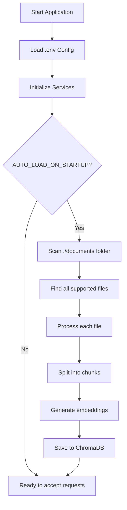
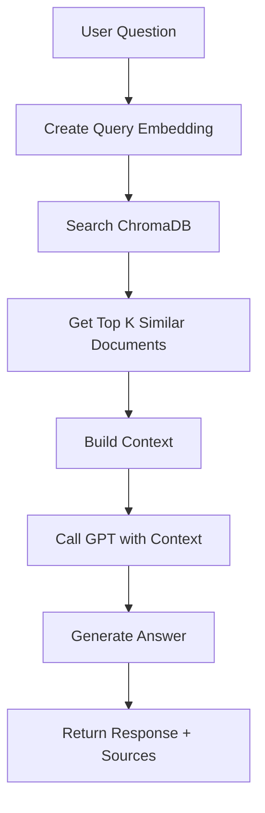

# Kiến Trúc & Cách Hoạt Động của RAG Chatbot API

## 📋 Tổng Quan

RAG (Retrieval-Augmented Generation) Chatbot API là hệ thống AI kết hợp việc tìm kiếm thông tin từ documents với khả năng sinh text của GPT để trả lời câu hỏi một cách chính xác và có ngữ cảnh.

### Nguyên Tắc Hoạt Động

```
Documents → Embeddings → Vector DB → Search → Context → GPT → Answer
```

## 🏗️ Kiến Trúc Hệ Thống

### Sơ Đồ Tổng Quan

```
┌─────────────────────────────────────────────────────────────┐
│                     RAG CHATBOT API                         │
├─────────────────────────────────────────────────────────────┤
│                                                             │
│  ┌──────────────┐      ┌──────────────┐                     │
│  │   FastAPI    │      │   Swagger    │                     │
│  │   Endpoints  │◄────►│   UI/Docs    │                     │
│  └──────┬───────┘      └──────────────┘                     │
│         │                                                   │
│         ├──────────┬──────────────┬──────────────┐          │
│         ▼          ▼              ▼              ▼          │
│  ┌──────────┐ ┌──────────┐ ┌──────────┐ ┌──────────┐        │
│  │   Chat   │ │ Document │ │  Upload  │ │  Status  │        │
│  │ Service  │ │ Service  │ │ Service  │ │ Service  │        │
│  └────┬─────┘ └────┬─────┘ └────┬─────┘ └──────────┘        │
│       │            │             │                          │
│       └────────────┼─────────────┘                          │
│                    ▼                                        │
│         ┌─────────────────────┐                             │
│         │   ChromaDB          │                             │
│         │   Vector Database   │                             │
│         └─────────────────────┘                             │
│                    │                                        │
│                    ▼                                        │
│         ┌─────────────────────┐                             │
│         │   OpenAI API        │                             │
│         │   - Embeddings      │                             │
│         │   - Chat GPT        │                             │
│         └─────────────────────┘                             │
└─────────────────────────────────────────────────────────────┘
```

## 🔄 Quy Trình Hoạt Động Chi Tiết

### Phase 1: Khởi Động & Load Documents



#### Bước 1: Quét Thư Mục Documents

```python
# Trong document_service.py

def auto_load_documents():
    """
    Tự động load documents từ thư mục mặc định
    """
    # 1. Xác định thư mục
    documents_folder = Path("./documents")
    
    # 2. Tìm tất cả files theo pattern
    file_patterns = ["*.py", "*.md", "*.txt", "*.json", 
                     "*.yaml", "*.docx", "*.pdf"]
    
    # 3. Lọc file hợp lệ
    valid_files = []
    for pattern in file_patterns:
        for file_path in documents_folder.rglob(pattern):
            # Kiểm tra size
            if file_path.stat().st_size <= MAX_FILE_SIZE_MB * 1024 * 1024:
                valid_files.append(file_path)
    
    # 4. Xử lý từng file
    for file_path in valid_files:
        process_single_file(file_path)
```

#### Bước 2: Xử Lý File

```python
def _process_single_file(file_path):
    """
    Xử lý một file duy nhất
    """
    # 1. Chọn loader phù hợp
    loader = _get_loader(file_path)
    
    # 2. Load nội dung
    documents = loader.load()
    
    # 3. Split thành chunks
    chunks = text_splitter.split_documents(documents)
    
    # 4. Thêm metadata
    for chunk in chunks:
        chunk.metadata = {
            "source": str(file_path),
            "file_type": file_path.suffix,
            "file_name": file_path.name,
            "file_size": file_path.stat().st_size
        }
    
    return chunks
```

**Ví dụ thực tế:**

```
File: employee_management_system/README.md (5,120 bytes)
    ↓
Load content: "# Hệ Thống Quản Lý Nhân Viên\n\n## Tổng Quan..."
    ↓
Split into chunks (chunk_size=1000, overlap=200):
    Chunk 1: "# Hệ Thống Quản Lý Nhân Viên\n\n## Tổng Quan..."
    Chunk 2: "...## Đặc Trưng Chính\n### Quản Lý Phòng Ban..."
    Chunk 3: "...### Quản Lý Nhân Viên\n- Thông tin cá nhân..."
    Chunk 4: "...## Công Nghệ Sử Dụng\n- FastAPI..."
    Chunk 5: "...## API Endpoints\nPOST /employees..."
    Chunk 6: "...## Bảo Mật\n- JWT Token..."
    ↓
Total: 6 chunks
```

#### Bước 3: Tạo Embeddings

```python
def _add_documents_to_db(documents):
    """
    Chuyển đổi text thành vector embeddings
    """
    # 1. Trích xuất text từ chunks
    texts = [doc.page_content for doc in documents]
    
    # 2. Gọi OpenAI Embedding API
    embeddings = openai_embeddings.embed_documents(texts)
    
    # 3. Lưu vào ChromaDB
    collection.add(
        embeddings=embeddings,
        documents=texts,
        metadatas=[doc.metadata for doc in documents],
        ids=[f"doc_{i}_{hash(text[:100])}" for i, text in enumerate(texts)]
    )
```

**Embedding là gì?**

Embedding chuyển đổi text thành vector số để máy tính hiểu ngữ nghĩa:

```
Text: "Hệ thống quản lý nhân viên giúp theo dõi thông tin nhân sự"
    ↓ OpenAI text-embedding-ada-002
Vector (1536 chiều): 
[0.023, -0.891, 0.234, 0.567, -0.123, 0.789, ..., 0.456]
           ↑
    Mỗi số đại diện cho một "khía cạnh" ngữ nghĩa
```

**Tại sao cần Embeddings?**

- Text có ngữ nghĩa giống nhau → Vector gần nhau
- Cho phép tìm kiếm theo ý nghĩa, không chỉ từ khóa
- "nhân viên" và "người lao động" → vectors tương tự

### Phase 2: Chat & Trả Lời Câu Hỏi



#### Bước 1: Nhận Câu Hỏi

```http
POST /chat
Content-Type: application/json

{
  "message": "Làm sao để tạo nhân viên mới trong hệ thống?",
  "conversation_id": null,
  "max_tokens": 1000,
  "temperature": 0.7
}
```

#### Bước 2: Tạo Query Embedding

```python
# Trong document_service.py

def search_similar_documents(query, k=5):
    """
    Tìm documents tương tự với câu hỏi
    """
    # 1. Tạo embedding cho câu hỏi
    query_embedding = openai_embeddings.embed_query(query)
    
    # query_embedding = [0.123, -0.456, 0.789, ...]
```

#### Bước 3: Tìm Kiếm Vector Similarity

```python
    # 2. Tìm trong ChromaDB
    results = collection.query(
        query_embeddings=[query_embedding],
        n_results=k,  # Lấy top 5
        include=["documents", "metadatas", "distances"]
    )
```

**Vector Similarity Search hoạt động thế nào?**

```
Query Vector:     [0.1, 0.9, 0.2, ...]

Document Vectors in DB:
Doc 1: [0.12, 0.88, 0.19, ...]  → Cosine similarity: 0.96 ✓ (Very similar)
Doc 2: [0.5, 0.3, 0.8, ...]     → Cosine similarity: 0.75 ✓ (Similar)
Doc 3: [-0.8, 0.1, -0.9, ...]   → Cosine similarity: 0.32 ✗ (Not similar)
Doc 4: [0.11, 0.91, 0.21, ...]  → Cosine similarity: 0.98 ✓ (Most similar!)
Doc 5: [0.2, 0.7, 0.3, ...]     → Cosine similarity: 0.85 ✓ (Similar)

→ Return top 5: Doc 4, Doc 1, Doc 5, Doc 2, (Doc 6...)
```

**Kết quả tìm kiếm:**

```json
[
  {
    "content": "## API Endpoints\n\n### Employees\n```\nPOST /api/v1/employees\n```\nTạo nhân viên mới với thông tin: fullName, email, phone, departmentId...",
    "metadata": {
      "source": "./documents/employee_management_system/docs/API_DOCUMENTATION.md",
      "file_name": "API_DOCUMENTATION.md"
    },
    "score": 0.92
  },
  {
    "content": "class Employee:\n    fullName: str\n    email: str\n    phone: str\n    departmentId: int\n    position: str\n    hireDate: date\n    salary: float",
    "metadata": {
      "source": "./documents/employee_management_system/models/employee.py"
    },
    "score": 0.88
  },
  {
    "content": "### Thêm Nhân Viên Mới\n\n1. Truy cập menu Employees\n2. Click nút 'Thêm mới'\n3. Điền form với thông tin bắt buộc\n4. Upload CV nếu có\n5. Click 'Lưu'",
    "metadata": {
      "source": "./documents/employee_management_system/docs/USER_GUIDE.md"
    },
    "score": 0.85
  }
]
```

#### Bước 4: Xây Dựng Context

```python
# Trong chat_service.py

def chat(message, conversation_id=None):
    """
    Xử lý chat với RAG
    """
    # 1. Tìm documents liên quan
    similar_docs = document_service.search_similar_documents(
        message, 
        k=5
    )
    
    # 2. Xây dựng context từ documents tìm được
    context = "\n\n---\n\n".join([
        f"Document {i+1} (Source: {doc['metadata']['file_name']}):\n{doc['content']}"
        for i, doc in enumerate(similar_docs)
    ])
```

**Context được tạo:**

```
Document 1 (Source: API_DOCUMENTATION.md):
## API Endpoints

### Employees
```
POST /api/v1/employees
```
Tạo nhân viên mới với thông tin: fullName, email, phone, departmentId...

---

Document 2 (Source: employee.py):
class Employee:
    fullName: str
    email: str
    phone: str
    departmentId: int
    position: str
    hireDate: date
    salary: float

---

Document 3 (Source: USER_GUIDE.md):
### Thêm Nhân Viên Mới

1. Truy cập menu Employees
2. Click nút 'Thêm mới'
3. Điền form với thông tin bắt buộc
4. Upload CV nếu có
5. Click 'Lưu'
```

#### Bước 5: Gọi GPT

```python
    # 3. Tạo messages cho GPT
    messages = [
        {
            "role": "system",
            "content": f"""Bạn là trợ lý AI thông minh, giúp người dùng trả lời câu hỏi về dự án dựa trên tài liệu được cung cấp.

Dựa vào context sau để trả lời câu hỏi của người dùng:

{context}

Hướng dẫn:
- Trả lời chính xác dựa trên context
- Nếu không tìm thấy thông tin, nói rõ
- Trích dẫn nguồn khi có thể
- Trả lời bằng tiếng Việt rõ ràng, dễ hiểu"""
        },
        {
            "role": "user",
            "content": message
        }
    ]
    
    # 4. Gọi OpenAI GPT
    response = openai_client.chat.completions.create(
        model="GPT-4o-mini",
        messages=messages,
        temperature=0.7,
        max_tokens=1000
    )
    
    answer = response.choices[0].message.content
```

#### Bước 6: Trả Về Kết Quả

```json
{
  "response": "Để tạo nhân viên mới trong hệ thống, bạn có thể thực hiện theo các cách sau:\n\n**1. Qua Giao Diện Web:**\n- Truy cập menu 'Employees'\n- Click nút 'Thêm mới'\n- Điền form với các thông tin bắt buộc: Họ tên, Email, Số điện thoại, Phòng ban, Chức vụ\n- Upload CV nếu có\n- Click 'Lưu'\n\n**2. Qua API:**\n```\nPOST /api/v1/employees\n{\n  \"fullName\": \"Nguyễn Văn A\",\n  \"email\": \"a.nguyen@company.com\",\n  \"phone\": \"0912345678\",\n  \"departmentId\": 1,\n  \"position\": \"Developer\",\n  \"hireDate\": \"2024-01-15\",\n  \"salary\": 15000000\n}\n```\n\n**Các trường bắt buộc:**\n- fullName (Họ tên)\n- email (Email hợp lệ)\n- phone (Số điện thoại)\n- departmentId (ID phòng ban)\n\n*Nguồn: API_DOCUMENTATION.md, USER_GUIDE.md*",
  
  "conversation_id": "550e8400-e29b-41d4-a716-446655440000",
  
  "sources": [
    {
      "content": "## API Endpoints...",
      "metadata": {
        "source": "./documents/employee_management_system/docs/API_DOCUMENTATION.md",
        "file_name": "API_DOCUMENTATION.md"
      },
      "score": 0.92,
      "rank": 1
    },
    {
      "content": "class Employee:...",
      "metadata": {
        "source": "./documents/employee_management_system/models/employee.py"
      },
      "score": 0.88,
      "rank": 2
    },
    {
      "content": "### Thêm Nhân Viên Mới...",
      "metadata": {
        "source": "./documents/employee_management_system/docs/USER_GUIDE.md"
      },
      "score": 0.85,
      "rank": 3
    }
  ],
  
  "metadata": {
    "model": "GPT-4o-mini",
    "tokens_used": 856,
    "retrieval_count": 3,
    "processing_time_ms": 1250
  }
}
```

## 🗄️ Cấu Trúc ChromaDB

### Collection Schema

```python
Collection: "documents"
├── Metadata
│   ├── name: "documents"
│   ├── description: "RAG documents collection"
│   └── created_at: "2024-10-30T10:30:00Z"
│
└── Documents (Chunks)
    ├── Document ID: "doc_0_abc123def456"
    │   ├── Embedding: [1536 dimensions float array]
    │   ├── Text: "Hệ thống quản lý nhân viên là..."
    │   └── Metadata:
    │       ├── source: "./documents/README.md"
    │       ├── file_type: ".md"
    │       ├── file_name: "README.md"
    │       ├── file_size: 5120
    │       └── chunk_index: 0
    │
    ├── Document ID: "doc_1_ghi789jkl012"
    │   ├── Embedding: [1536 dimensions]
    │   ├── Text: "## Đặc Trưng Chính..."
    │   └── Metadata: {...}
    │
    └── ... (nhiều documents khác)
```

### Ví Dụ Thực Tế

```json
{
  "id": "doc_42_a1b2c3d4e5f6",
  "embedding": [
    0.023145, -0.891234, 0.234567, 0.567890, -0.123456,
    0.789012, 0.345678, -0.901234, 0.456789, 0.012345,
    // ... 1526 số nữa (tổng 1536)
  ],
  "document": "POST /api/v1/employees\n\nTạo nhân viên mới trong hệ thống.\n\n**Request Body:**\n```json\n{\n  \"fullName\": \"string\",\n  \"email\": \"string\",\n  \"phone\": \"string\",\n  \"departmentId\": \"integer\",\n  \"position\": \"string\",\n  \"hireDate\": \"date\",\n  \"salary\": \"float\"\n}\n```\n\n**Response:** 201 Created",
  "metadata": {
    "source": "./documents/employee_management_system/docs/API_DOCUMENTATION.md",
    "file_type": ".md",
    "file_name": "API_DOCUMENTATION.md",
    "file_size": 15840,
    "chunk_index": 7
  }
}
```

